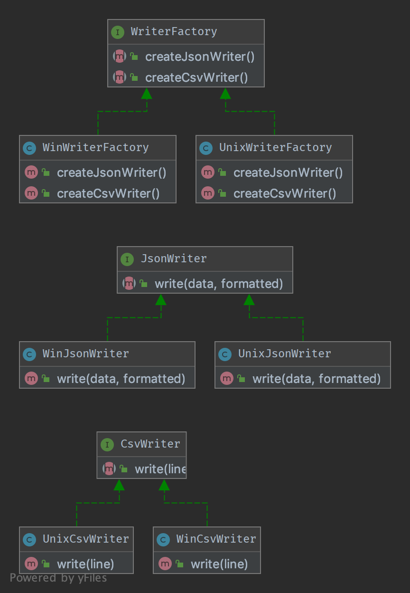

# creational

describtion:
```
In software engineering, creational design patterns are design patterns that deal with object creation mechanisms, trying to create objects in a manner suitable to the situation. The basic form of object creation could result in design problems or added complexity to the design. Creational design patterns solve this problem by somehow controlling this object creation.
```

## Abstract Factory

To create series of related or dependent objects without specifying their concrete classes. Usually the created classes all implement the same interface. The client of the abstract factory does not care about how these objects are created, it just knows how they go together.



## Builder

Builder is an interface that build parts of a complex object.
Just like build a vehicle.
就像是构建一辆车，Builder方法定义了一辆车需要哪些零件。即使用interface来约束。
不同的车对接口的实现不同。不关心具体的实现。提供一样的接口即可。


## 

## singalton

..wait
